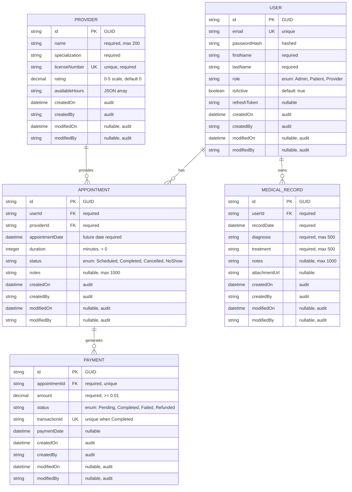

# Data Model: Backend Setup

**Feature**: Backend Setup (003-backend-setup)  
**Created**: 2026-04-09  
**Purpose**: Define core entity models, relationships, validation rules, and audit patterns

---

## Entity Relationship Diagram (Mermaid)



---

## Core Entities

### 1. User Entity (AuditableEntity)

**Purpose**: Represents patients, providers, and system administrators

**Domain Layer** (`Domain/Entities/User.cs`):

```csharp
public class User : AuditableEntity {
    // Identifiers
    public string Email { get; set; } // Unique, immutable after creation
    public string PasswordHash { get; set; } // Bcrypt or Argon2 hashed
    
    // Personal Information
    public string FirstName { get; set; }
    public string LastName { get; set; }
    
    // Authorization
    public UserRole Role { get; set; } // Admin | Patient | Provider
    
    // Status
    public bool IsActive { get; set; } = true;
    
    // Authentication
    public string? RefreshToken { get; set; }
    public DateTime? RefreshTokenExpiresAt { get; set; }
    
    // Navigation Properties
    public ICollection<Appointment> AppointmentsAsPatient { get; set; } = new List<Appointment>();
    public ICollection<MedicalRecord> MedicalRecords { get; set; } = new List<MedicalRecord>();
}

public enum UserRole {
    Admin = 0,
    Patient = 1,
    Provider = 2
}
```

**Validations**:
- Email: Valid email format; max 255 characters; must be unique globally
- PasswordHash: Non-empty; minimum 60 characters (Bcrypt hash length)
- FirstName: Required; 1-100 characters; no special characters except apostrophe/hyphen
- LastName: Required; 1-100 characters; no special characters except apostrophe/hyphen
- Role: Must be valid enum value (0, 1, or 2)
- IsActive: Cannot set past appointments for inactive users
- RefreshToken: Optional; unique when populated; 128+ characters
- Registration Mapping: Public Stitch UI registration accepts `fullName`; backend MUST split this value into `FirstName` and `LastName` before persisting.

**Relationships**:
- 1-to-many: User → Appointments (as patient)
- 1-to-many: User → MedicalRecords (owns)
- 1-to-many: User → Payments (implicit through appointments)

**Audit Pattern**:
- CreatedOn: Set at record creation, immutable
- CreatedBy: User ID or "system" (immutable)
- ModifiedOn: Set on any update, nullable before first edit
- ModifiedBy: User ID or "system" (nullable before first edit)

---

### 2. Appointment Entity (AuditableEntity)

**Purpose**: Represents healthcare service appointments between patients and providers

**Domain Layer** (`Domain/Entities/Appointment.cs`):

```csharp
public class Appointment : AuditableEntity {
    // Identifiers
    public Guid UserId { get; set; }           // FK to User (patient)
    public Guid ProviderId { get; set; }       // FK to Provider
    
    // Appointment Details
    public DateTime AppointmentDate { get; set; }  // Must be future date
    public int DurationMinutes { get; set; }       // > 0
    public AppointmentStatus Status { get; set; } // Scheduled | Completed | Cancelled | NoShow
    public string? Notes { get; set; }             // Optional clinical notes, max 1000
    
    // Navigation Properties
    public User Patient { get; set; } = null!;
    public Provider Provider { get; set; } = null!;
    public Payment? Payment { get; set; }
}

public enum AppointmentStatus {
    Scheduled = 0,
    Completed = 1,
    Cancelled = 2,
    NoShow = 3
}
```

**Validations**:
- UserId: Must reference existing active User record
- ProviderId: Must reference existing Provider record
- AppointmentDate: Must be future date; cannot be in past; not more than 365 days ahead
- DurationMinutes: Must be > 0; typically 15, 30, 45, 60 (validate against provider availability)
- Status: Must be valid enum; state transitions: Scheduled → (Completed | Cancelled | NoShow); cannot change completed appointments
- Notes: Optional; max 1000 characters; sanitized to prevent injection

**Relationships**:
- Many-to-one: Appointment → User (patient)
- Many-to-one: Appointment → Provider
- One-to-one: Appointment ← Payment (cascade delete if appointment deleted)

**State Transitions**:
- Scheduled (initial) → Completed (after appointment time)
- Scheduled → Cancelled (anytime before appointment)
- Scheduled → NoShow (if time passes without activity)
- Cannot transition from Completed, Cancelled, or NoShow back to Scheduled

---

### 3. Provider Entity (AuditableEntity)

**Purpose**: Represents healthcare service providers

**Domain Layer** (`Domain/Entities/Provider.cs`):

```csharp
public class Provider : AuditableEntity {
    // Provider Information
    public string Name { get; set; }                    // max 200 characters
    public string Specialization { get; set; }          // e.g., "Cardiology", "Pediatrics"
    public string LicenseNumber { get; set; }           // Unique per provider
    
    // Rating & Availability
    public decimal Rating { get; set; } = 0m;           // 0.0 to 5.0, 1 decimal place
    public int ReviewCount { get; set; } = 0;           // Number of reviews
    
    // Availability Schedule (JSON stored as string)
    public string AvailableHoursJson { get; set; }      // JSON: { "monday": ["09:00", "17:00"], ... }
    
    // Status
    public bool IsActive { get; set; } = true;
    
    // Navigation Properties
    public ICollection<Appointment> Appointments { get; set; } = new List<Appointment>();
}

public class AvailabilitySchedule {
    public Dictionary<string, TimeSlot[]> WeeklySchedule { get; set; } // monday through sunday
    
    public class TimeSlot {
        public TimeOnly StartTime { get; set; }
        public TimeOnly EndTime { get; set; }
    }
}
```

**Validations**:
- Name: Required; 1-200 characters; no special characters (letters, numbers, spaces, hyphens allowed)
- Specialization: Required; max 100 characters; predefined list (enum or lookup table)
- LicenseNumber: Required; unique globally; format: [2 letter state code]-[6 digits] (e.g., "CA-123456")
- Rating: 0.0 to 5.0 scale; exactly 1 decimal place; calculated from reviews (not user-editable)
- ReviewCount: Non-negative integer; incremented only when new review added
- AvailableHours: JSON array of day-time pairs; must have at least one time slot; validates TimeOnly values
- IsActive: Cannot book appointments with inactive provider

**Relationships**:
- One-to-many: Provider → Appointments (provides)

**Special Rules**:
- Rating cannot be directly updated; calculated as average of all appointment review ratings
- AvailableHours must be checked before creating appointments
- Cannot delete provider with existing appointments (soft delete via IsActive flag)

---

### 4. Medical Record Entity (AuditableEntity)

**Purpose**: Stores patient medical history and clinical notes

**Domain Layer** (`Domain/Entities/MedicalRecord.cs`):

```csharp
public class MedicalRecord : AuditableEntity {
    // Relationships
    public Guid UserId { get; set; }                    // FK to User (patient)
    
    // Record Details
    public DateTime RecordDate { get; set; }            // When record was created
    public string Diagnosis { get; set; }               // Clinical diagnosis, max 500
    public string Treatment { get; set; }               // Treatment provided, max 500
    public string? Notes { get; set; }                  // Additional clinical notes, max 1000
    public string? AttachmentUrl { get; set; }          // Reference to uploaded file (S3, Azure Blob, etc.)
    
    // Navigation Properties
    public User Patient { get; set; } = null!;
}
```

**Validations**:
- UserId: Must reference existing User record
- RecordDate: Must be past or current date; cannot be future date
- Diagnosis: Required; 1-500 characters; sanitized for injection prevention
- Treatment: Required; 1-500 characters; sanitized for injection prevention
- Notes: Optional; max 1000 characters
- AttachmentUrl: Optional; must be valid URL; should be https only

**Relationships**:
- Many-to-one: MedicalRecord → User (patient)

**Access Control**:
- Only the patient (UserId) and assigned healthcare providers can view records
- Only healthcare providers and record creator can modify records
- Audit fields track who accessed/modified each record

---

### 5. Payment Entity (AuditableEntity)

**Purpose**: Tracks financial transactions for appointments

**Domain Layer** (`Domain/Entities/Payment.cs`):

```csharp
public class Payment : AuditableEntity {
    // Relationships
    public Guid AppointmentId { get; set; }             // FK to Appointment (one-to-one)
    
    // Payment Details
    public decimal Amount { get; set; }                 // Must be >= 0.01
    public PaymentStatus Status { get; set; }           // Pending | Completed | Failed | Refunded
    public string? TransactionId { get; set; }          // External payment processor ID (Stripe, PayPal, etc.)
    public DateTime? PaymentDate { get; set; }          // Actual payment completion date
    public string? FailureReason { get; set; }          // Reason if Status = Failed
    
    // Navigation Properties
    public Appointment Appointment { get; set; } = null!;
}

public enum PaymentStatus {
    Pending = 0,      // Awaiting payment
    Completed = 1,    // Successfully charged
    Failed = 2,       // Payment failed
    Refunded = 3      // Refund issued
}
```

**Validations**:
- AppointmentId: Must reference existing Appointment; must be unique (one payment per appointment)
- Amount: Must be > 0; exactly 2 decimal places (currency format validation)
- Status: Must be valid enum; state transitions: Pending → (Completed | Failed); Completed → Refunded
- TransactionId: Must be unique when Status = Completed; required for completed payments; immutable
- PaymentDate: Must be set when Status = Completed; must be current date or earlier
- FailureReason: Optional; populated only when Status = Failed

**Relationships**:
- One-to-one: Payment ← Appointment (each appointment has max one payment)

**State Transitions**:
- Pending (initial) → Completed (successful charge)
- Pending → Failed (charge declined)
- Completed → Refunded (refund issued)
- Cannot transition from Failed to any other status (immutable failure)

---

## Base Entity: AuditableEntity

**Location**: `Domain/Entities/Base/AuditableEntity.cs`

```csharp
public abstract class AuditableEntity {
    public Guid Id { get; set; } = Guid.NewGuid();
    
    // Audit Fields (automatically populated by interceptor)
    public DateTime CreatedOn { get; set; }             // UTC timestamp
    public string CreatedBy { get; set; } = null!;      // User ID or "system"
    public DateTime? ModifiedOn { get; set; }            // UTC timestamp, nullable until first edit
    public string? ModifiedBy { get; set; }              // User ID or "system", nullable until first edit
}
```

**Audit Interceptor** (`Infrastructure/Persistence/AuditableEntityInterceptor.cs`):

Automatically sets audit fields on:
- **Create**: Sets CreatedOn to current UTC time, CreatedBy to current user
- **Update**: Sets ModifiedOn to current UTC time, ModifiedBy to current user

---

## Entity Mapping Strategy

### DTO Separation (Anti-Corruption Layer)

For each entity, create corresponding DTOs:

```csharp
// Application/DTOs/UserDto.cs
public class UserDto {
    public Guid Id { get; set; }
    public string Email { get; set; }
    public string FirstName { get; set; }
    public string LastName { get; set; }
    public string Role { get; set; }
}

// Application/DTOs/CreateUserRequest.cs (Input DTO)
public class CreateUserRequest {
    public string Email { get; set; }
    public string Password { get; set; }
    public string FirstName { get; set; }
    public string LastName { get; set; }
    public string Role { get; set; }
}

// Application/DTOs/UpdateUserRequest.cs (Update DTO)
public class UpdateUserRequest {
    public string? FirstName { get; set; }
    public string? LastName { get; set; }
}
```

**Mapping Pattern** (via AutoMapper):
```csharp
public class MappingProfile : Profile {
    public MappingProfile() {
        CreateMap<User, UserDto>();
        CreateMap<CreateUserRequest, User>();
        CreateMap<UpdateUserRequest, User>();
        
        CreateMap<Appointment, AppointmentDto>();
        CreateMap<CreateAppointmentRequest, Appointment>();
        
        // Include audit fields in response DTOs
        CreateMap<User, UserDetailDto>()
            .ForMember(dest => dest.CreatedOn, opt => opt.MapFrom(src => src.CreatedOn))
            .ForMember(dest => dest.CreatedBy, opt => opt.MapFrom(src => src.CreatedBy))
            .ForMember(dest => dest.ModifiedOn, opt => opt.MapFrom(src => src.ModifiedOn))
            .ForMember(dest => dest.ModifiedBy, opt => opt.MapFrom(src => src.ModifiedBy));
    }
}
```

---

## Database Constraints

### Primary Keys
- All entities use GUID as primary key (UUID in database)
- Rationale: Distributed system friendly, globally unique, prevents ID guessing attacks

### Foreign Keys
- User.Id → referenced by Appointment (UserId), MedicalRecord (UserId)
- Provider.Id → referenced by Appointment (ProviderId)
- Appointment.Id → referenced by Payment (AppointmentId)
- All FK columns are NOT NULL (required relationships)
- Cascade delete options: Appointments deleted when User disabled; Payments deleted when Appointment cancelled

### Unique Constraints
- User.Email (case-insensitive unique)
- Provider.LicenseNumber (case-insensitive unique)
- Payment.AppointmentId (one payment per appointment)
- Payment.TransactionId (when Status = Completed)

### Indexes
- User.Email: B-tree index for login lookups
- Appointment.UserId, ProviderId: Composite index for patient/provider queries
- Appointment.AppointmentDate: Range index for filtering by date
- Payment.Status: Index for payment status reports
- All audit fields: Indexed for audit queries

---

## Migration Strategy

**Naming Convention**: `[YYYYMMDD]_[ChangeDescription].cs`

**Initial Migration** (`001_InitialCreate.cs`):
- Create all 5 entity tables (User, Appointment, Provider, MedicalRecord, Payment)
- Add all indexes and constraints
- Add audit fields to all tables

**Subsequent Migrations**:
- Isolate each schema change: Never combine multiple model changes
- Example: Adding a column, changing a column type, renaming a column each get separate migration
- Keep migrations small for easier troubleshooting and rollback capability

---

## Seed Data Strategy

**Location**: `Infrastructure/Persistence/SeedData.cs`

**Development Seed**:
- 5 sample users (2 patients, 2 providers, 1 admin)
- 10 sample appointments (mix of statuses)
- 3 sample medical records
- 8 sample payments (mix of statuses)

**Production Seed**:
- Admin user account only (created during initial deployment)
- No dummy data

**Execution**:
```csharp
// Program.cs
if (app.Environment.IsDevelopment()) {
    using var scope = app.Services.CreateScope();
    var dbContext = scope.ServiceProvider.GetRequiredService<ApplicationDbContext>();
    await dbContext.SeedDataAsync();
}
```

---

## Data Integrity Checks

### Temporal Validations
- Appointment.AppointmentDate > DateTime.UtcNow (cannot book past appointments)
- MedicalRecord.RecordDate <= DateTime.UtcNow (cannot create future records)
- Payment.PaymentDate <= DateTime.UtcNow (payment only timestamped after completion)

### Referential Integrity
- All FK constraints enforced at database level
- Cannot create Appointment without valid User and Provider
- Cannot create Payment without valid Appointment

### Business Rules
- User.IsActive checked before allowing appointments
- Provider.IsActive checked before allowing new appointments
- Appointment status transitions validated before state change
- Payment amount must match appointment cost (if applicable)

---

**Status**: ✅ Data model complete and validated.

**Next**: Create API contracts (contracts/) and quickstart.md
