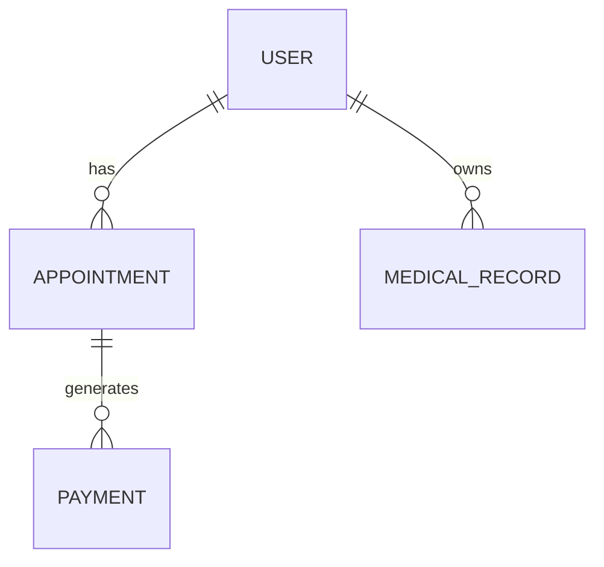

# Data Model: Backend API Stitch Alignment

**Feature**: Backend API Stitch Alignment (004-backend-api-stitch-alignment)  
**Created**: 2026-04-10  
**Purpose**: Define the API request/response shapes and entity mapping required by the Stitch registration and auth flows.

---

## API DTOs

### RegistrationRequest

```csharp
public class RegistrationRequest {
    public string FullName { get; set; } = null!;
    public string Email { get; set; } = null!;
    public string Password { get; set; } = null!;
    public string ConfirmPassword { get; set; } = null!;
}
```

**Validation Rules**:
- `FullName`: Required; 2-256 characters; letters, spaces, apostrophes, hyphens allowed.
- `Email`: Required; valid email format; max 254 characters.
- `Password`: Required; 8-128 characters; must include uppercase, lowercase, number, and special character.
- `ConfirmPassword`: Required; must exactly match `Password`.

### RegisterSuccessResponse

```csharp
public class RegisterSuccessResponse {
    public string UserId { get; set; } = null!;
    public string Email { get; set; } = null!;
    public string FirstName { get; set; } = null!;
    public string LastName { get; set; } = null!;
    public string Message { get; set; } = null!;
}
```

### LoginRequest

```csharp
public class LoginRequest {
    public string Email { get; set; } = null!;
    public string Password { get; set; } = null!;
}
```

### AuthResponse

```csharp
public class AuthResponse {
    public string AccessToken { get; set; } = null!;
    public string RefreshToken { get; set; } = null!;
    public int ExpiresIn { get; set; }
    public UserDto User { get; set; } = null!;
}
```

### UserDto

```csharp
public class UserDto {
    public string Id { get; set; } = null!;
    public string Email { get; set; } = null!;
    public string FirstName { get; set; } = null!;
    public string LastName { get; set; } = null!;
    public string Role { get; set; } = null!;
    public bool IsActive { get; set; }
}
```

## Domain Entities

### User Entity

```csharp
public class User : AuditableEntity {
    public string Email { get; set; } = null!;
    public string PasswordHash { get; set; } = null!;
    public string FirstName { get; set; } = null!;
    public string LastName { get; set; } = null!;
    public UserRole Role { get; set; } = UserRole.Patient;
    public bool IsActive { get; set; } = true;
    public string? RefreshToken { get; set; }
    public DateTime? RefreshTokenExpiresAt { get; set; }
}
```

**Mapping Notes**:
- The Stitch UI uses a single `fullName` input; the backend MUST split it into `FirstName` and `LastName` before saving.
- If `fullName` contains only one token, store it as `FirstName` and leave `LastName` empty.
- The registration flow defaults the role to `Patient` when created from the public UI.

## Entity Relationships



## Audit Pattern

All persisted entities must include auditable fields:

- `CreatedOn` - timestamp when record is created
- `CreatedBy` - user identifier or "system"
- `ModifiedOn` - timestamp when record is updated
- `ModifiedBy` - user identifier or "system"

## Notes

- This data model focuses on the UI contract for patient registration and auth.
- Additional domain entities such as `Provider`, `Appointment`, and `MedicalRecord` are defined in the backend setup data model and reused by this feature.
